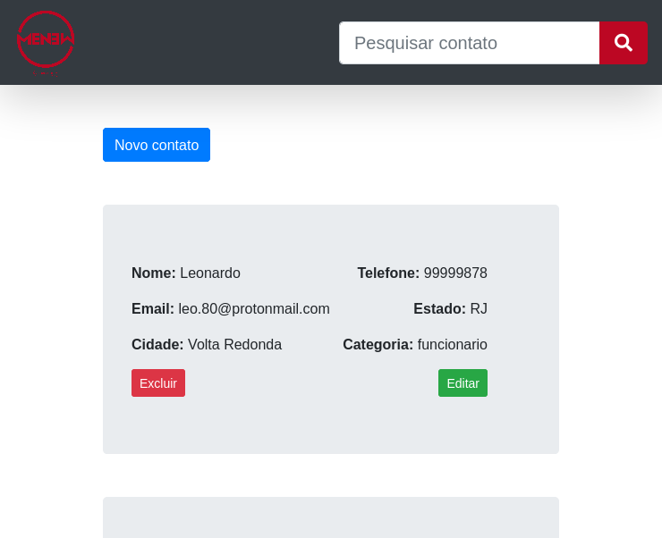

# TESTE PARA DESENVOLVEDOR (1)



## Tabela de Conteúdo

-   [Tecnologias Utilizadas](#Tecnologias-Utilizadas)
-   [Instalação e Uso](#Instalação-e-Uso)
-   [Endpoints](#Endpoints)

## Tecnologias Utilizadas

-   PHP
-   JavaScript
-   Laravel
-   Bootstrap
-   MySQL
-   RESTful API

## Instalação e Uso

### Clonando o repositório:

```bash
$ git clone https://github.com/LeoDev0/menew-teste1.git
```

### Criando banco de dados MySQL

```bash
mysql> CREATE DATABASE menew
```

### Instalando e execundo:

```bash
$ cd menew-teste1
$ php artisan migrate:fresh
$ php artisan serve --port=8000
```

A aplicação estará rodando em `http://localhost:8000/`.

## Endpoints

### /api/contacts

-   `GET`: Lista todos os contatos;
-   `POST`: Cria novo contato.

### /api/contacts/?search=

-   `GET`: Pesquisa contatos pelos campos de nome, email, cidade, estado e categoria.

### /api/contacts/{id}

-   `GET`: Lista todos os dados de um único contato;
-   `PUT`: Edita dados de um contato;
-   `DELETE`: Deleta um contato.
